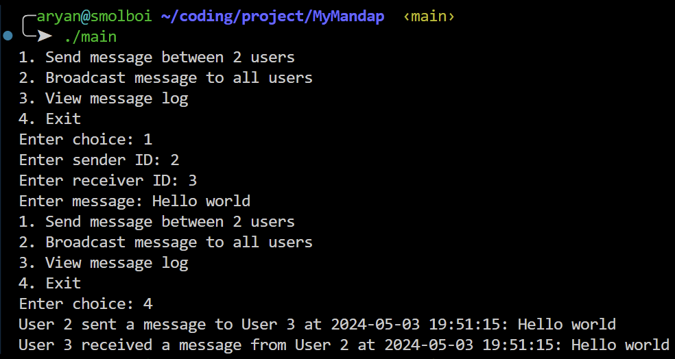
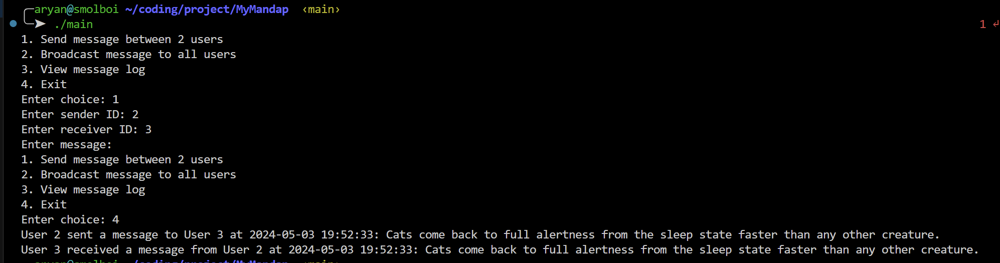
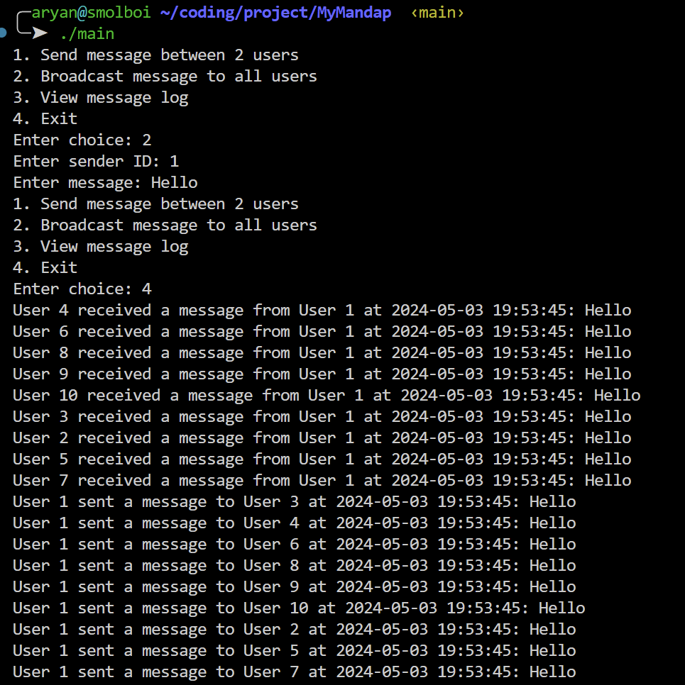
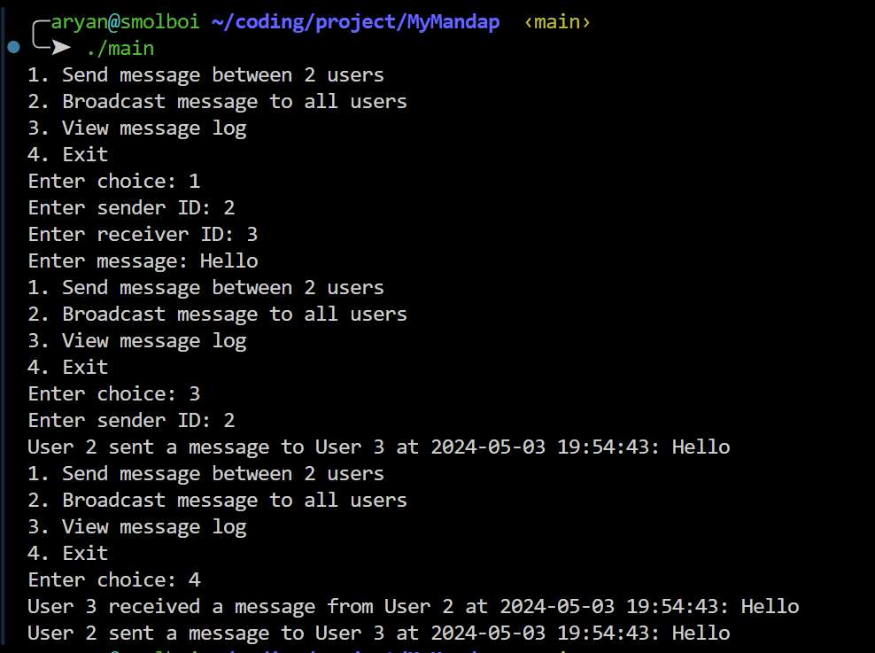

# MyMandap Task

## How to get it running?

1. Clone the repository
2. Navigate to the root directory of the project
3. Run the following command to build the executable
```bash
make setup
```
4. Run the executable
```bash
./main
```

## Code Structure

```
📦MyMandap
 ┣ 📂helpers
 ┃ ┣ 📜fact.go
 ┃ ┣ 📜log.go
 ┃ ┗ 📜message.go
 ┣ 📂models
 ┃ ┗ 📜user.go
 ┣ 📂utils
 ┃ ┗ 📜input.go
 ┣ 📜.gitignore
 ┣ 📜Makefile
 ┣ 📜README.md
 ┣ 📜go.mod
 ┣ 📜main
 ┗ 📜main.go
```

Functionalities:
1. Send a message to an user

1.1 without a message

2. Send a message to all users

3. View message log of an user
